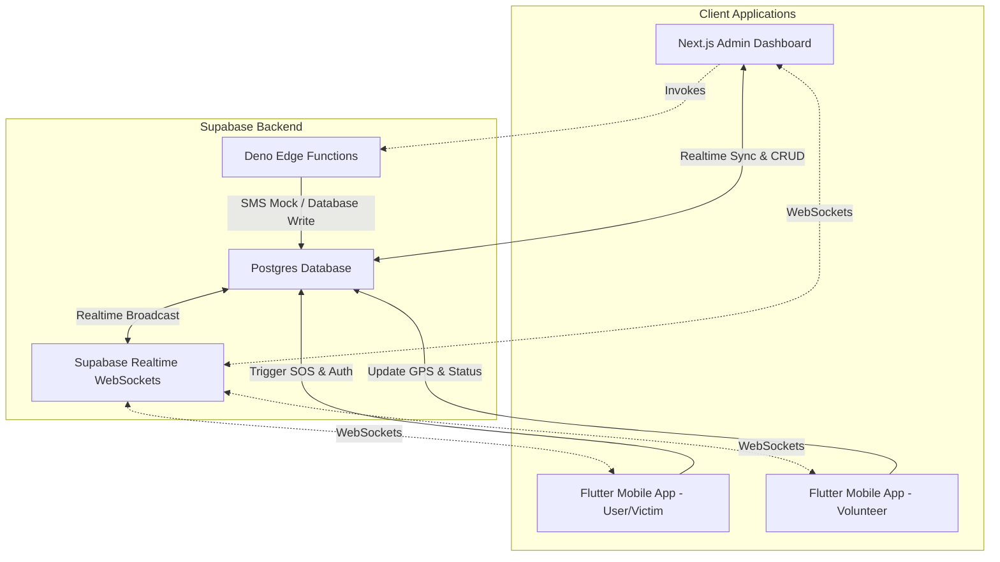

# ResQLink Emergency Response Platform - Development Guide

Welcome to the ResQLink knowledge base. This document outlines the architecture, database schema, real-time sync mechanism, edge function definitions, and the mobile application specifications for the ResQLink platform.

---

## 1. System Architecture

---

## 2. Database Schema (PostgreSQL)

The database schema utilizes standard PostgreSQL coordinates and custom proximity calculations instead of PostGIS geography types to guarantee 100% database compatibility and avoid schema search path issues.

### Tables

#### `public.users`
Stores all account details, credentials, and medical logs:
*   `id` (UUID PRIMARY KEY DEFAULT gen_random_uuid())
*   `name` (TEXT)
*   `email` (TEXT UNIQUE)
*   `phone` (TEXT)
*   `blood_group` (TEXT)
*   `role` (TEXT: 'User', 'Volunteer', 'Admin')
*   `status` (TEXT: 'Active', 'Suspended')
*   `password` (TEXT: local password-based login verification)
*   `age` (INTEGER)
*   `gender` (TEXT)
*   `address` (TEXT)
*   `allergies` (TEXT)
*   `medical_conditions` (TEXT)
*   `special_notes` (TEXT)
*   `profile_picture` (TEXT)
*   `created_at` (TIMESTAMPTZ)

#### `public.volunteers`
Stores category, availability, rating, and coordinates of registered responders:
*   `id` (UUID PRIMARY KEY REFERENCES users(id) ON DELETE CASCADE)
*   `category` (TEXT: 'community', 'ambulance', 'hospital')
*   `government_id` (TEXT)
*   `government_id_image` (TEXT)
*   `qualification` (TEXT)
*   `skills` (TEXT)
*   `is_verified` (TEXT: 'Pending', 'Verified', 'Suspended')
*   `is_available` (TEXT: 'Available', 'Busy', 'Offline')
*   `rating` (NUMERIC)
*   `total_cases` (INTEGER)
*   `successful_cases` (INTEGER)
*   `latitude` (NUMERIC)
*   `longitude` (NUMERIC)
*   `response_time` (INTERVAL)
*   `joined_at` (TIMESTAMPTZ)

#### `public.sos_incidents`
Records active and past emergency alerts triggered by victims:
*   `id` (TEXT PRIMARY KEY, e.g. `SOS-802`)
*   `victim_id` (UUID REFERENCES users(id) ON DELETE SET NULL)
*   `victim_name` (TEXT)
*   `phone` (TEXT)
*   `blood_group` (TEXT)
*   `latitude` (NUMERIC)
*   `longitude` (NUMERIC)
*   `status` (TEXT: 'Pending', 'In Progress', 'Accepted', 'Resolved', 'Cancelled')
*   `severity` (TEXT: 'Critical', 'High', 'Medium', 'Low')
*   `incident_type` (TEXT)
*   `emergency_contact` (TEXT)
*   `assigned_volunteer_id` (UUID REFERENCES volunteers(id))
*   `detection_type` (TEXT: 'manual', 'impact', 'fall', 'speed_drop')
*   `created_at` (TIMESTAMPTZ)
*   `resolved_at` (TIMESTAMPTZ)

#### `public.emergency_contacts`
Allows users to save multiple contacts for emergency notifications:
*   `id` (UUID PRIMARY KEY DEFAULT gen_random_uuid())
*   `user_id` (UUID REFERENCES users(id) ON DELETE CASCADE)
*   `name` (TEXT)
*   `phone` (TEXT)
*   `relation` (TEXT)

#### `public.issues`
Tracks app support tickets filed by users:
*   `id` (TEXT PRIMARY KEY, e.g. `tkt-106`)
*   `user_id` (UUID REFERENCES users(id) ON DELETE SET NULL)
*   `user_name` (TEXT)
*   `title` (TEXT)
*   `description` (TEXT)
*   `priority` (TEXT: 'High', 'Medium', 'Low')
*   `status` (TEXT: 'Open', 'In Progress', 'Resolved', 'Closed')
*   `created_at` (TIMESTAMPTZ)

---

## 3. Database Triggers & Math Calculations

### Mathematical Proximity Functions
Computes distances between coordinates without requiring PostGIS extensions using the Haversine formula:

1.  **`calculate_distance(lat1, lon1, lat2, lon2)`**: Calculates distance in meters between two GPS coordinates:
    $$\text{distance} = 2r \arcsin\left(\sqrt{\sin^2\left(\frac{\Delta\text{lat}}{2}\right) + \cos(\text{lat}_1)\cos(\text{lat}_2)\sin^2\left(\frac{\Delta\text{lon}}{2}\right)}\right)$$
2.  **`find_closest_volunteers(p_latitude, p_longitude, p_max_distance_meters, p_limit)`**: Finds the closest active, verified, and available volunteers around an incident location.

### Automatic Role Sync Trigger
Whenever a user's role is updated to `'Volunteer'`, a database trigger (`tr_sync_volunteer_profile`) automatically creates an offline, pending profile in the `volunteers` table.

---

## 4. Next.js Admin Dashboard Integration

The dashboard features clean, client-side data mutations and real-time page updates:

*   **Real-time Synchronization**: Implements `supabase.channel("live_sync")` listeners. When a new SOS incident or volunteer status is updated, the stats counters, charts, activity feed, and live tables refresh instantly on screen without browser reloads.
*   **Database-Driven Login**: Employs custom credentials validation against `public.users` table for rapid mock sandbox execution, storing the active session locally.
*   **Details Modals**: Expanded user and volunteer profile modals to support all Phase 2 details (age, gender, address, medical info, and government ID categories).

---

## 5. Deno Edge Functions

Located under `supabase/functions/`:

1.  **`assign-volunteer`**: Invoked by the dashboard when allocating a responder to an SOS:
    *   Sets incident status to `'In Progress'`.
    *   Sets volunteer availability to `'Busy'`.
    *   Logs mock dispatch and emergency contact SMS triggers.
2.  **`notify-volunteers`**: Locates nearby available volunteers within a specified radius (using the custom Haversine query) and broadcasts alert notifications.

---

## 6. Phase 2 Flutter Mobile App Scope

The upcoming Flutter mobile application integrates with the same schema:

### Role-Based Features
*   **User/Victim Mode**:
    *   Manual Emergency Trigger (Crimson SOS Button).
    *   Sensor-based Automatic Accident Detection (simulating accelerometer/gyroscope/speed drop triggers with a 15-second safety safety confirmation countdown).
    *   Real-time dispatch status tracking.
    *   **Nearby Incidents (Community Aid)**: Lists active emergencies within 2km with **hidden names and phone numbers** to maintain privacy, showing only distance (e.g. *"Road Accident - 300m away"*).
*   **Volunteer Mode**:
    *   Availability Toggle & background location updates.
    *   Verification Form (Government ID upload simulation).
    *   Responder Map Navigation (Google Maps routing).
    *   **Volunteer Self-SOS Button**: Allows a volunteer in danger to trigger their own emergency request.

### 🔒 Phone Privacy Rule
To protect victims and responders, **phone numbers of any user will not be shown to others in the mobile app**. Only the Admin Dashboard operators will see phone numbers to verify identities and coordinate emergency calls.
